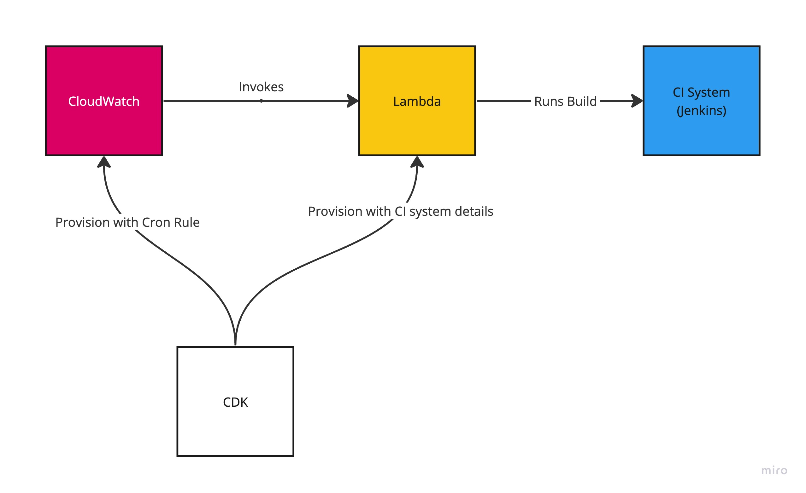

# Scheduled CI Runner (Golang)

This repo creates a CloudWatch schedule for building a remote Jenkins build. Ideally, we shouldn't be dependent on a schedule, but rather some event that takes place where we can invoke our build.

One of the considerations was how generic the CI runner needs to be. For this project, we only support a remote Jenkins build. However, it should be fairly simple to extend this to fan out to multiple CI runners or to be able to easily swap the CI Runner out for another.

## Opertaional Flow



## Setup

### Tooling

* In order to setup the AWS access, I use aws-vault, [see](https://github.com/99designs/aws-vault) for installation instructions.
* This project uses CDK for provisioning, you can install:
    ```
    npm install -g cdk
    ```
### Environment Config

Copy the sample config and update with your Jenkins details. I also included my `AWS_ACCOUNT_ID` (`aws-vault` doesn't include this in the env and it's required).

`cp example.env .env`

### Jenkins Config

[see README.md](jenkins/README.md)

## Deployment

Note that the cdk commands need to be run from the cdk directory.

Synth the changes to get an idea of what's being orchestrated.
```
aws-vault exec personal -- cdk synth
```

Deploying stack
```
aws-vault exec personal -- cdk deploy
```

Destroying stack
```
aws-vault exec personal -- cdk destroy
```